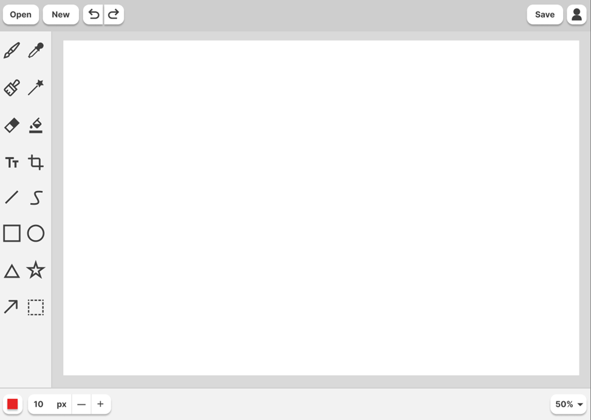
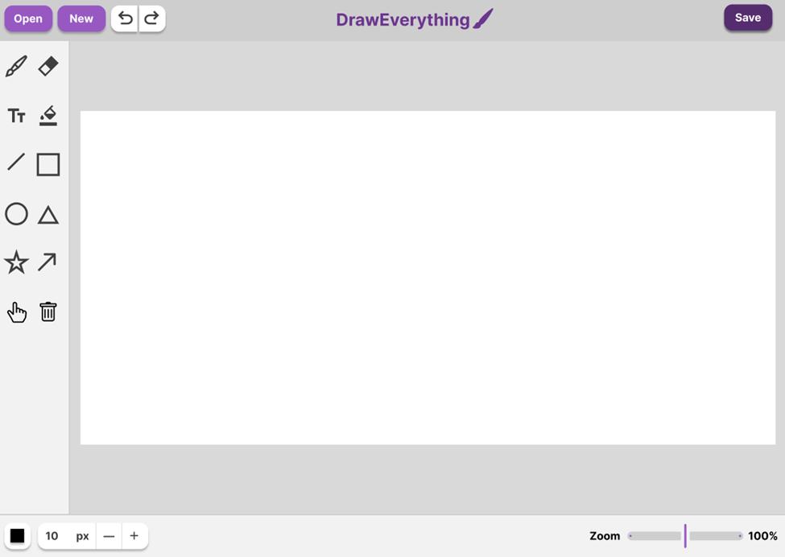
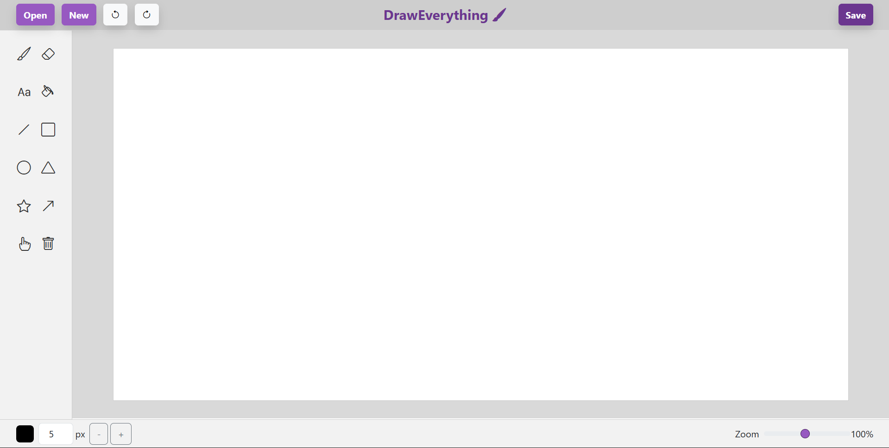

# DrawEverything Web Application
## Internship Project Report @ KidoCode Sdn. Bhd.
- **Report Prepared By:** Isdianahaiza Binti Sutan Ahmad
- **Internship Period:** 11th August 2025 – 5th October 2025 
- **Supervisor:** Trainer Farhad 
- **Date:** 5th October 2025 

---

## Table of Contents
1. [Project Overview](#1-project-overview)
2. [Development Process](#2-development-process)
3. [Technical Implementation](#3-technical-implementation)
4. [Results and Outcomes](#4-results-and-outcomes)
5. [Conclusion](#5-conclusion)

---

## 1. Project Overview

This report documents the development of **DrawEverything**, a browser-based drawing application created during my internship. The project demonstrates proficiency in modern web development technologies including HTML5 Canvas API, CSS3, JavaScript, and Bootstrap framework customization using Sass. The application provides users with a comprehensive set of drawing tools including brush, eraser, shapes, text, and fill bucket functionality, all within an intuitive and responsive interface.

### 1.1 Key Features
- **Drawing Tools**: Brush, eraser, line, rectangle, circle, triangle, star, and arrow
- **Advanced Features**: Text tool, fill bucket with flood fill algorithm, pan and zoom
- **Canvas Management**: Undo/redo functionality, save/open images, clear canvas
- **User Interface**: Fixed resolution canvas (1270×610px), zoom controls (10%-200%), color picker, adjustable brush size

### 1.2 Technologies Used
- **Figma**: UI/UX design and prototyping
- **HTML5**: Structure and Canvas API for drawing functionality
- **CSS3**: Styling and layout with custom properties
- **JavaScript**: Core application logic and event handling
- **Bootstrap 5.3.3**: UI framework for responsive components
- **Sass**: CSS preprocessing for Bootstrap customization

---

## 2. Development Process

### 2.1 Phase 1: Design and Prototyping (Figma)


**Initial Prototype Design:**
- Inspired by the application **Drawing**, a free and open-source basic image editor designed for **Linux** and particularly aiming at the GNOME desktop
- Layout planning with three main sections: top navbar, left toolbar, and bottom control bar
- Color scheme selection (multiple shades of grey)
- Tool icon selection from multiple icons library, vectors, and shapes
- Canvas size determination was not set

### 2.2 Phase 2: HTML Structure

The HTML structure was built with semantic elements and proper document organization:

```html
- Navigation bar (file operations: Open, New, Save; edit operations: Undo, Redo)
- Left sidebar with tool grid (12 tools in 2×10 grid layout instead of 16)
- Central drawing area with dual canvas setup (main + temporary canvas)
- Bottom control bar (color picker, brush size controls, zoom slider)
- Modal dialog for new drawing confirmation
```

### 2.3 Phase 3: CSS Styling and Layout

CSS implementation focused on creating a professional, functional interface:

**Styling Highlights:**
```css
- Custom hover effects on buttons (purple theme)
- Active state styling for selected tools
- Grid-based tool button layout for consistent spacing
- Responsive cursor changes based on active tool
- Z-index management for proper layering of UI elements
```

**CSS Custom Properties:**
- Accent color: #9759c1 (purple)
- Neutral backgrounds: #F2F2F2, #D9D9D9
- Border colors: #CECECE

### 2.4 Phase 4: JavaScript Implementation

JavaScript development was divided into functional modules:

#### a. Canvas Initialization
- Set fixed internal resolution (1270×610px) for consistent output
- White background fill for proper image export

**Tool Implementation:**
- **Brush/Eraser**: Real-time path drawing with `lineTo()` method
- **All Shapes**: Preview on temporary canvas, commit on mouseup

#### b. Advanced Features


**Text Tool:**
- Dynamic input element creation at click position
- Font size scaling (3× brush size) for visibility
- Screen-to-canvas coordinate transformation
- Automatic focus and event handling (Enter to confirm, Escape to cancel)

**Flood Fill Algorithm:**
Implemented stack-based flood fill to avoid recursion depth issues:
```javascript
- Get starting pixel color
- Use stack to track pixels to process
- Check and fill neighboring pixels matching start color
- Use Set to track visited pixels and prevent infinite loops
```

**Pan and Zoom:**
- Zoom range: 10% to 200% via range slider
- Pan functionality with "Hand" tool using CSS transforms
- Transform origin at center for intuitive zoom behavior
- Coordinate system compensation for zoom level

#### c. Undo/Redo System
Stack-based history management:
```javascript
- undoStack: stores canvas states as data URLs
- redoStack: stores states when undoing
- saveState(): captures current canvas after each operation
- Keyboard shortcuts: Ctrl+Z (undo), Ctrl+Y/Ctrl+Shift+Z (redo)
```

#### d. File Operations

**Open Function:**
- FileReader API for image loading
- Aspect ratio preservation with scaling
- Centered placement on canvas
- Support for all standard image formats

**New Drawing:**
- Modal confirmation system
- Conditional messaging based on save state
- Option to save before clearing

**Save Function:**
- Canvas to PNG conversion using `toDataURL()`
- Automatic download trigger
- State tracking for unsaved changes

### 2.5 Phase 5: Bootstrap Customization with Sass

Sass was used to customize Bootstrap's default theme to match the application's branding:

**Customization Approach:**
```scss
// import the functions & variables
@import '../node_modules/bootstrap/scss/_functions';
@import '../node_modules/bootstrap/scss/_variables';

$custom-theme-colors: (
    "altmain": #6b368f,
    "altlight": #9759c1,
    "altdark": #552d6f,
    "topmenu": #CECECE
);

$theme-colors: map-merge($custom-theme-colors, $theme-colors);

// import bootstrap
@import '../node_modules/bootstrap/scss/bootstrap';
```

**`IMPORTANT`:** If the interface doesn't look like the intended final design, please make sure to use "Live Sass Compiler" extension and click on "Watch Sass" at the bottom bar of Visual Studio Code

## 3. Technical Implementation

### 3.1 Canvas Architecture

**Dual Canvas System:**
- **Main Canvas (`drawCanvas`)**: Permanent storage of all committed drawings
- **Temporary Canvas (`tempCanvas`)**: Live preview layer for shapes and tool feedback
- **Benefits**: Clean separation of preview and final content, smooth user experience

### 3.2 Event Handling

**Mouse Events:**
```javascript
mousedown: Initiate drawing/tool action
mousemove: Continue drawing or show preview
mouseup: Finalize drawing action
mouseleave: Clean up if user leaves canvas area
```

**Keyboard Events:**
- Undo/Redo shortcuts
- Text tool confirmation/cancellation
- Cross-platform support (Ctrl for Windows/Linux, Cmd for Mac)

### 3.3 State Management

**Application State Variables:**
```javascript
- currentTool: Active tool selection
- drawing: Boolean for drag state
- brushColor, brushSize: Current drawing parameters
- undoStack, redoStack: History management
- zoomLevel, panX, panY: View transformation
- isSaved: Track unsaved changes
```

### 3.4 Performance Considerations

**Optimizations:**
- Fixed canvas resolution to prevent scaling artifacts
- Stack-based flood fill to handle large fill areas
- Prompts user to confirm to start new drawing ('New' button) with modals under different conditions (save state)

---

## 4. Results and Outcomes

### 4.1 Final design (Figma)


### 4.2 Completed Project look


### 4.3 Design-to-Implementation Fidelity

The final implementation closely matches the Figma prototype with a few touchups:
- Color scheme has changed from grey to purple
- Layout proportions maintained
- Number of tools have decreased for simplicity
- Icon usage consistent with design, but all icons are from Bootstrap in the final design
- Zoom feature have changed to slider for easy use
- Added brand logo on the navbar
- Removed unimplemented buttons (like user button)

---

## 5. Conclusion

### 5.1 Project Summary

The DrawEverything web application successfully brought a design concept to life as a working drawing tool. Throughout this project, I worked with various web technologies and solved practical problems like making the zoom and pan features work correctly, implementing a paint bucket tool that doesn't crash, and creating a smooth drawing experience.

### 5.2 Reflection

This internship project gave me practical experience building a complete web application from start to finish. I learned how important it is to think about the user experience, write organized code, and work through problems step by step. The challenges I faced and overcame during this project have given me more confidence to take on future web development work.

---

## Appendix

### References
- Drawing (Linux drawing application)
- Figma Design Documentation
- MDN Web Docs - Canvas API
- Bootstrap 5.3 Documentation
- Stack Overflow community

---


